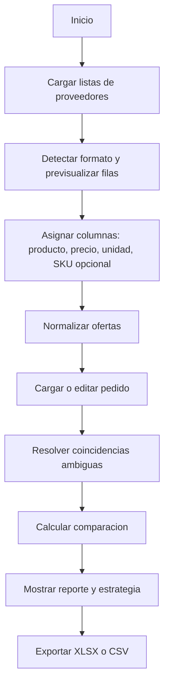

# Comprador Inteligente - Arquitectura MVP

## 1. Objetivo

Aplicacion web para cargar listas de precios de multiples proveedores y un pedido
de compra, normalizar productos con reglas deterministas, comparar ofertas y
generar una estrategia optima de compra.

La Fase 1 no usa IA generativa, login, backend ni base de datos. Todos los
archivos se procesan localmente en el navegador. Solo los datos procesados
necesarios para reconstruir la ultima sesion se guardan en `localStorage`.

## 2. Alcance

### Incluido

- Carga de listas de proveedores en `.xlsx`, `.xls`, `.csv` y `.pdf`.
- Carga de pedido en `.xlsx`, `.xls` y `.csv`, mas edicion manual en tabla.
- Asistente para elegir columnas cuando el archivo no coincide con el formato
  esperado.
- Normalizacion basica de nombres, unidades y precios.
- Deteccion de coincidencias exactas, alias confirmados y sugerencias por
  similitud.
- Revision manual de coincidencias ambiguas antes del calculo final.
- Mejor precio y proveedor por producto.
- Diferencia porcentual entre proveedores.
- Total del pedido y estrategia de compra dividida por proveedor.
- Exportacion del reporte a `.xlsx` y `.csv`.

### Fuera de alcance

- OCR para PDF escaneados.
- Extraccion perfecta de cualquier PDF.
- Persistencia remota o historial de sesiones.
- Usuarios, permisos o historial.
- Stock, costos de envio, impuestos complejos, descuentos por volumen, plazos
  de pago o minimos de compra.
- Optimizacion de carrito consolidado con restricciones comerciales.
- Integraciones con ERPs o APIs de proveedores.

## 3. Decisiones de arquitectura

| Decision | Eleccion MVP | Motivo |
| --- | --- | --- |
| Ejecucion | Frontend-only | Evita backend y mantiene las listas dentro del navegador. |
| Framework | Astro + React + TypeScript | Astro arma la aplicacion y React resuelve el flujo interactivo. |
| Estado | Store en memoria + `localStorage` | Recupera la ultima sesion local sin guardar archivos originales. |
| Excel | `xlsx` (SheetJS) | Lectura y exportacion de planillas. |
| CSV | Parser CSV con soporte de delimitador y encoding | Evita parseos manuales fragiles. |
| PDF | `pdfjs-dist` | Extrae texto de PDF digitales. |
| Validacion | `zod` | Valida filas normalizadas y configuraciones de importacion. |
| Identificadores | `crypto.randomUUID()` | IDs de sesion sin servidor. |
| Calculo | Funciones puras TypeScript | Facilita pruebas y mantiene reglas auditables. |

Se recomienda usar React solo en el area interactiva principal como una isla de
Astro. El procesamiento de archivos puede moverse a un Web Worker si las listas
reales superan aproximadamente 5.000 filas o si la UI pierde fluidez.

## 4. Flujo de usuario



La aplicacion debe bloquear el reporte final mientras existan filas invalidas
del pedido o productos del pedido sin resolver. Las ofertas invalidas se
excluyen del calculo, pero se muestran con su motivo.

## 5. Pantallas

### 5.1 Inicio y carga

- Dropzone para varias listas de proveedores.
- Campo editable para nombrar cada proveedor; por defecto usa el nombre del
  archivo.
- Dropzone separado para el pedido.
- Opcion para crear el pedido manualmente.

### 5.2 Importacion

- Vista previa de las primeras 20 filas.
- Selector de hoja para Excel.
- Selectores de columnas: producto, precio, unidad, SKU y presentacion.
- Separador decimal configurable si la deteccion automatica falla.
- Para PDF: tabla extraida editable antes de importar.
- Resumen: filas aceptadas, filas excluidas y errores.

### 5.3 Normalizacion

- Lista de productos del pedido con estado:
  - `resuelto`: coincidencia exacta o alias confirmado;
  - `sugerido`: posible equivalencia pendiente;
  - `sin coincidencia`: no se encontro oferta util.
- Accion para confirmar, rechazar o crear un alias de sesion.
- Vista de nombres originales agrupados bajo el producto canonico.

### 5.4 Reporte

- Resumen: costo total optimo, cantidad de proveedores seleccionados y ahorro
  frente al proveedor unico mas barato que cubra todo el pedido.
- Tabla por producto: cantidad, unidad, mejor precio, proveedor ganador,
  segundo mejor precio, diferencia porcentual y subtotal.
- Tabla por proveedor: productos a comprar y subtotal.
- Panel de exclusiones y productos sin oferta.
- Exportacion.

## 6. Modelo de datos

```ts
type Id = string;

interface Supplier {
  id: Id;
  name: string;
  sourceFileName: string;
}

interface RawRow {
  rowNumber: number;
  values: Record<string, unknown>;
}

interface ImportMapping {
  sheetName?: string;
  productColumn: string;
  priceColumn: string;
  unitColumn?: string;
  skuColumn?: string;
  packageSizeColumn?: string;
  decimalSeparator?: "." | ",";
}

type Unit = "kg" | "g" | "l" | "ml" | "unit" | "pack" | "unknown";

interface SupplierOffer {
  id: Id;
  supplierId: Id;
  originalName: string;
  normalizedName: string;
  canonicalProductId?: Id;
  sku?: string;
  sourceRow: number;
  price: number;
  currency: "ARS";
  unit: Unit;
  packageSize: number;
  comparablePrice?: number;
  comparableUnit?: Unit;
  warnings: string[];
}

interface PurchaseItem {
  id: Id;
  originalName: string;
  normalizedName: string;
  canonicalProductId?: Id;
  quantity: number;
  unit: Unit;
  warnings: string[];
}

interface CanonicalProduct {
  id: Id;
  displayName: string;
  normalizedName: string;
  aliases: string[];
}

interface MatchSuggestion {
  purchaseItemId: Id;
  offerId: Id;
  score: number;
  reason: "exact" | "alias" | "similarity";
  status: "accepted" | "pending" | "rejected";
}

interface ProductComparison {
  purchaseItemId: Id;
  offers: ComparableOffer[];
  bestOffer?: ComparableOffer;
  secondBestOffer?: ComparableOffer;
  spreadPercent?: number;
  subtotal?: number;
}

interface ComparableOffer {
  offerId: Id;
  supplierId: Id;
  comparablePrice: number;
  requestedQuantity: number;
  subtotal: number;
}

interface PurchaseStrategy {
  comparisons: ProductComparison[];
  supplierOrders: SupplierOrder[];
  total: number;
  unresolvedItemIds: Id[];
}

interface SupplierOrder {
  supplierId: Id;
  items: ProductComparison[];
  subtotal: number;
}
```

En Fase 1 la moneda es una configuracion global de la sesion, inicialmente
`ARS`. No se deben comparar unidades incompatibles. Una oferta sin unidad puede
compararse unicamente si el pedido y las demas ofertas equivalentes tambien se
interpretan como `unit`.

## 7. Pipeline de importacion

### 7.1 Contrato comun

Cada parser devuelve:

```ts
interface ParsedTable {
  sourceType: "xlsx" | "csv" | "pdf";
  sheets: string[];
  selectedSheet?: string;
  headers: string[];
  rows: RawRow[];
  warnings: string[];
}
```

La UI transforma `ParsedTable` en `SupplierOffer[]` mediante `ImportMapping`.
Esto evita mezclar extraccion de archivos con reglas de negocio.

### 7.2 Excel

1. Leer workbook con `xlsx`.
2. Mostrar hojas disponibles.
3. Convertir la hoja elegida a filas.
4. Detectar encabezados probables.
5. Pedir confirmacion de mapeo.

### 7.3 CSV

1. Detectar delimitador entre coma, punto y coma y tabulacion.
2. Detectar encabezados.
3. Mostrar vista previa.
4. Pedir confirmacion de mapeo.

Conviene usar un parser CSV dedicado, por ejemplo `papaparse`, por su manejo de
comillas, delimitadores y filas irregulares.

### 7.4 PDF

1. Extraer texto por pagina con `pdfjs-dist`.
2. Reconstruir lineas usando posiciones horizontales y verticales.
3. Intentar detectar filas con nombre y precio.
4. Mostrar siempre una tabla editable antes de importar.

Los PDF escaneados se rechazan con un mensaje claro: requieren OCR, que queda
para una fase posterior.

## 8. Normalizacion determinista

### 8.1 Nombre normalizado

Aplicar en orden:

1. Convertir a minusculas.
2. Usar Unicode NFD y quitar diacriticos.
3. Reemplazar puntuacion por espacios.
4. Colapsar espacios.
5. Separar tokens.
6. Aplicar diccionario acotado de equivalencias, por ejemplo plurales simples.
7. Ordenar tokens solo para calcular similitud; conservar el nombre legible.

Ejemplo:

| Original | Normalizado |
| --- | --- |
| `Almendras naturales` | `almendra natural` |
| `ALMENDRA, Natural` | `almendra natural` |

`Almendra pelada` no debe fusionarse automaticamente con `almendra natural`:
puede ser una variante comercial distinta. Se presenta como sugerencia para
revision manual.

### 8.2 Estrategia de coincidencia

1. Coincidencia exacta del nombre normalizado: aceptar automaticamente.
2. Alias confirmado en la sesion: aceptar automaticamente.
3. SKU coincidente dentro del mismo proveedor: usar como apoyo, no como
   identidad global.
4. Similitud de tokens: mostrar sugerencia, nunca aceptar automaticamente.

Para sugerencias se puede calcular Jaccard sobre tokens y distancia de
Levenshtein normalizada. Una regla inicial razonable:

```ts
score = 0.7 * tokenJaccard + 0.3 * normalizedLevenshtein;
```

- `score >= 0.85`: sugerencia destacada.
- `0.65 <= score < 0.85`: sugerencia secundaria.
- `score < 0.65`: no sugerir.

Los umbrales deben validarse con listas reales antes de ajustarse.

### 8.3 Unidades y presentaciones

Convertir ofertas a una unidad comparable:

| Entrada | Unidad comparable | Formula |
| --- | --- | --- |
| `1 kg` | `kg` | `precio / 1` |
| `500 g` | `kg` | `precio / 0.5` |
| `1 l` | `l` | `precio / 1` |
| `750 ml` | `l` | `precio / 0.75` |
| `pack x 12` | `unit` | `precio / 12` |

Si falta informacion para convertir, marcar la oferta como no comparable y
pedir correccion manual.

## 9. Calculo y estrategia optima

En el MVP cada item es independiente porque no existen costos de envio,
descuentos, stock ni minimos por proveedor. Por lo tanto, la estrategia optima
es elegir la oferta comparable de menor subtotal para cada producto:

```ts
subtotal = comparablePrice * requestedQuantity;
bestOffer = offers.sort((a, b) => a.subtotal - b.subtotal)[0];
total = sum(comparisons.map((item) => item.bestOffer?.subtotal ?? 0));
```

La diferencia porcentual principal compara la mejor oferta contra la segunda:

```ts
spreadPercent =
  ((secondBestPrice - bestPrice) / bestPrice) * 100;
```

El reporte tambien puede mostrar el rango completo entre minimo y maximo.

Como referencia util, calcular la mejor alternativa de proveedor unico entre
los proveedores que cubran todos los items. Esto permite mostrar el costo de la
comodidad de consolidar la compra:

```ts
savings = bestSingleSupplierTotal - optimalSplitTotal;
```

## 10. Estructura del proyecto

```text
comprador-inteligente/
  public/
  src/
    components/
      app/
        BuyerApp.tsx
      upload/
        FileDropzone.tsx
        ImportPreview.tsx
        ColumnMapper.tsx
      order/
        PurchaseOrderEditor.tsx
      matching/
        MatchReview.tsx
        AliasEditor.tsx
      report/
        ReportSummary.tsx
        ProductComparisonTable.tsx
        SupplierOrdersTable.tsx
        ExportButtons.tsx
    domain/
      types.ts
      normalize/
        normalizeProductName.ts
        normalizeUnit.ts
        similarity.ts
        matchProducts.ts
      pricing/
        buildComparableOffers.ts
        calculateStrategy.ts
    parsers/
      parseFile.ts
      parseCsv.ts
      parseExcel.ts
      parsePdf.ts
      detectColumns.ts
    exports/
      exportReportCsv.ts
      exportReportXlsx.ts
    store/
      buyerStore.ts
    workers/
      parse.worker.ts
    pages/
      index.astro
    styles/
      global.css
  tests/
    fixtures/
    unit/
    integration/
  astro.config.mjs
  package.json
  tsconfig.json
```

El Web Worker puede agregarse cuando sea necesario. Para el primer incremento,
mantener los parsers fuera del hilo principal solo si el volumen de archivos
reales lo justifica.

## 11. Componentes y responsabilidades

| Modulo | Responsabilidad |
| --- | --- |
| `parsers/*` | Extraer tablas sin tomar decisiones comerciales. |
| `domain/normalize/*` | Normalizar nombres, unidades y sugerir equivalencias. |
| `domain/pricing/*` | Crear ofertas comparables y calcular resultados. |
| `store/buyerStore.ts` | Orquestar el estado efimero de la sesion. |
| `components/upload/*` | Carga, previsualizacion y mapeo de columnas. |
| `components/matching/*` | Resolver ambiguedades y alias de sesion. |
| `components/report/*` | Presentar y exportar resultados. |
| `exports/*` | Generar archivos descargables. |

## 12. Estado de la aplicacion

```ts
interface BuyerState {
  suppliers: Supplier[];
  parsedTables: Record<Id, ParsedTable>;
  offers: SupplierOffer[];
  purchaseItems: PurchaseItem[];
  canonicalProducts: CanonicalProduct[];
  suggestions: MatchSuggestion[];
  strategy?: PurchaseStrategy;
  step: "upload" | "import" | "order" | "matching" | "report";
}
```

Usar `localStorage` solo para los datos procesados necesarios para reconstruir
la ultima sesion. No guardar archivos originales. La UI debe explicar que la
informacion queda en el navegador y ofrecer acciones para borrar la sesion
guardada o borrar todo.

## 13. Manejo de errores

| Caso | Comportamiento |
| --- | --- |
| Archivo corrupto | Rechazar archivo y mostrar motivo. |
| Extension no soportada | Mostrar formatos admitidos. |
| PDF sin texto extraible | Indicar que probablemente es escaneado y requiere OCR. |
| Precio vacio o invalido | Excluir oferta y mostrar fila de origen. |
| Unidad incompatible | Marcar oferta no comparable. |
| Producto del pedido sin oferta | Mostrarlo en reporte y excluirlo del total confirmado. |
| Coincidencia ambigua | Bloquear calculo final hasta revision. |
| Duplicado del mismo proveedor | Conservar ambas ofertas y seleccionar la mas economica; mostrar advertencia. |

## 14. Pruebas

### Unitarias

- Normalizacion de acentos, mayusculas, puntuacion y plurales simples.
- Similitud y umbrales.
- Conversiones `g -> kg`, `ml -> l` y `pack -> unit`.
- Parseo de precios con coma y punto decimal.
- Eleccion de mejor oferta.
- Diferencia porcentual.
- Proveedor unico vs compra dividida.
- Items sin oferta.

### Integracion

- Cargar dos Excel con columnas distintas y obtener un reporte.
- Cargar CSV con punto y coma.
- Editar tabla extraida de PDF antes de importar.
- Confirmar un alias y recalcular.
- Exportar reporte y validar columnas.

### Fixtures minimos

- Dos proveedores con nombres equivalentes: `Almendra natural` y
  `Almendras naturales`.
- Variante ambigua: `Almendra pelada`.
- Presentaciones equivalentes: `500 g` y `1 kg`.
- Precio invalido.
- PDF digital y PDF escaneado.

## 15. Criterios de aceptacion

1. El usuario carga al menos dos listas con formatos o columnas diferentes.
2. La aplicacion permite corregir el mapeo antes de importar.
3. Los nombres equivalentes simples se agrupan automaticamente.
4. Las variantes ambiguas requieren confirmacion.
5. Los precios se comparan solo en unidades compatibles.
6. El reporte muestra ganador, segundo precio, diferencia porcentual y
   subtotal por item.
7. El reporte muestra estrategia dividida por proveedor y total.
8. El reporte identifica items sin oferta y no los oculta dentro del total.
9. El usuario exporta el resultado a Excel o CSV.
10. Al recargar la pagina, la ultima sesion local se restaura con un aviso visible.

## 16. Implementacion por incrementos

### Incremento 1 - Camino principal

- Scaffold Astro + React + TypeScript.
- Carga Excel y CSV.
- Mapeo de columnas.
- Pedido manual.
- Normalizacion de nombres y unidades.
- Calculo y reporte en pantalla.

### Incremento 2 - Revision y exportacion

- Sugerencias por similitud.
- Alias de sesion.
- Importacion de pedido desde archivo.
- Exportacion Excel y CSV.
- Panel de errores y exclusiones.

### Incremento 3 - PDF y robustez

- Extraccion de PDF digital con tabla editable.
- Fixtures de proveedores reales anonimizados.
- Ajuste de umbrales.
- Web Worker si las mediciones lo justifican.

## 17. Evolucion posterior

La siguiente fase puede agregar persistencia y restricciones comerciales. En
ese momento la estrategia deja de ser una seleccion independiente por producto
y pasa a ser un problema de optimizacion con variables como envio, minimos,
stock y descuentos por volumen. Esa extension debe construirse sobre el mismo
contrato `SupplierOffer -> ComparableOffer -> PurchaseStrategy`, sin acoplarla
a los parsers.
